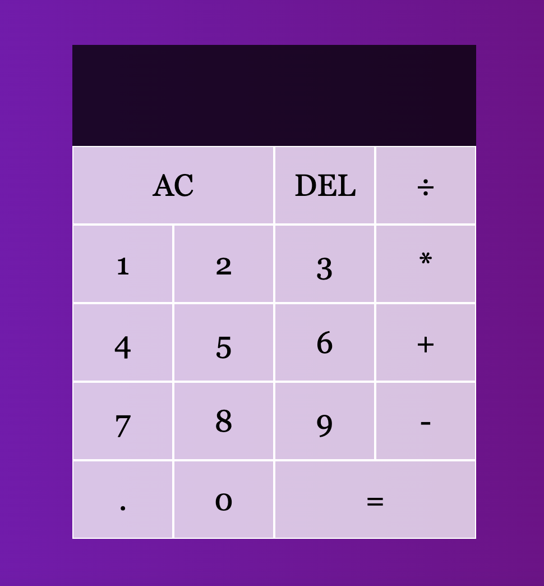

# JavaScript Calculator App

#### This app is a part of Odin project’s curriculum and servers as an example project for my personal web development portfolio. 

Calculator app lets users calculate the result of adding, subtracting, multiplying or dividing numbers. 

### Build with:

- JavaScript
- HTML 5
- CSS 3

*View and interact with the project [here](https://maarbay.github.io/calculator-app/)*

This application is built to showcase my understanding of JavaScript, alongside the ability to implement CSS and HTML. 
